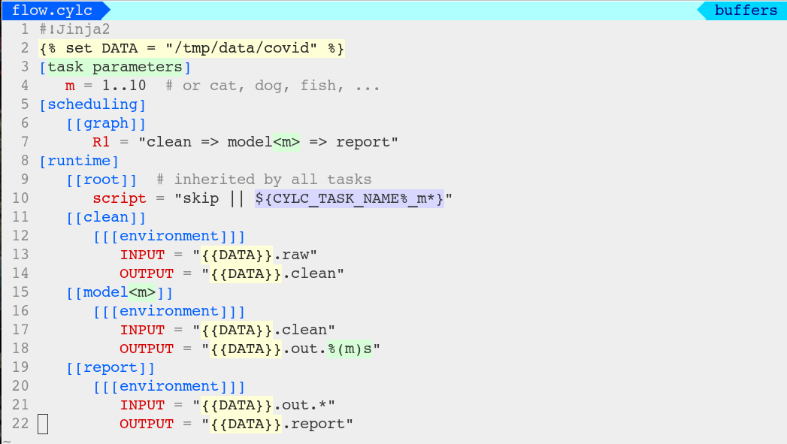
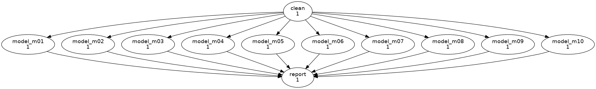

# A file-driven workflow with [Cylc](http://www.cylc.org)

## File-driven workflows

In the file-driven workflow paradigm (e.g. Snakemake) you specify input and
output files for each step, and rules to make those files. The system infers
the task graph by working backward (`make`-style): each step should run if its
output files don't already exist or are older than the input files.

This is an appropriate model if you need to rerun the same finite workflow
in the same workspace, after making changes that do not necessarily require
every step to rerun.

## Dependency-driven workflows

[Cylc](http://www.cylc.org) is natively dependency-driven: you specify a task
dependency graph that the scheduler executes from the top down. File IO
locations may be configured for tasks in order to get executables to cooperate
in the workflow context, but Cylc itself does not look at the files.

Dependency-driven workflows can respond to events that can't be inferred by
backward file checking. For example, you could trigger an alternate graph path
if a task fails *after* generating its expected outputs (the outputs could be
incomplete, say).

In fact conditional triggering is not compatible with the file-driven approach
in general. In `(A | B) => C`, if `C`s outputs don't exist, should they be
generated by `A` or by `B`?  In the top down approach, C will be triggered 
by A or B according to events at run time.

Dependency driven cycling workflows in Cylc can also continue indefinitely, in
which case there are no "final" output files to work back from.

## Having it both ways!

We can emulate the file-driven paradigm in Cylc by prefixing a file check to
each task and performing a noop if the outputs do not need to be regenerated.

The workflow is still driven by top-down dependencies, but the tasks don't
(re)generate files that are already up to date.

This has the same result as the bottom-up approach, but you can use other
dependency-driven devices at the same time. 

## A simple make-like ML use case

We want to compare N model configurations driven by the same input data:
1. Clean the raw input data to the form needed by the model
2. Run the N model configurations on the cleaned input data
3. Compare the output of the N model configurations and report results

Now add new model configurations and run the workflow again:
- The raw input data should not be reprocessed
- The new model configurations should run, but the original ones should not re-run
- The comparison and report task should run again, to include the new results

Change the raw input data and run the workflow again:
- Now all tasks should regenerate all of their output files.

## How to do it with Cylc

In the task definition below, the generic `skip` script (in the workflow `bin`
directory) compares the timestamps of multiple input and output files, and
returns failure status if the outputs need to be regenerated.

```ini
[[my-task]]
    script = "skip || my-exe"  # don't run exe if skip returns 0
    [[[environment]]]
        INPUT = "/path/to/input.*"
        OUTPUT = "/path/to/output.*"
```

## The source directory

```bash
.
├── flow.cylc  # Cylc workflow configuration
└── bin
    ├── clean  # toy data cleaning executable
    ├── model  # toy model executable
    ├── report  # toy model comparison report generator
    ├── fake-exe  # (fake output file generator)
    └── skip  # checks if output files are outdated
```

The complete workflow config - for any number of model configurations, 10 as
an example - looks like this:



Note we still have to write the dependency graph (it is not inferred from task
inputs and outputs). However: this has the advantage that you can understand
the workflow at a glance; and dependencies have other advantages (above).

Visualized with `cylc graph`:



## Things to note

### Task executable names

For convenience, the tasks have been given the same names as the executables,
so the same `script` item inherited from `root` can be used to invoke the
right executable by task name. The parametermised models are all invoked by the
same `model` executable, so we strip the parameter off the task name in that
case. (Each model run still knows its parameter value from the job environment).

### On-demand execution

Install and play a new instance of the worflow each time. Cylc is designed to
keep track of workflow state, including "workflow completed", and it will
restart rather then rerun from scratch if the same instance is re-played.:
```console
$ cylc install demo && cylc play demo && cylc tui demo
```

### The data directory

Tasks should normally read and write from the self-contained workflow run
directory, but for make-like model each new run needs access to the
same intermediate data files, so we keep everything in an external
data directory.


### Things to try

Watch progress at run time:
- `cylc tui demo  # (if installed as demo)`
- `watch -n 1 "ls -ort /tmp/data"  # to see outputs files appearing`

Run it again: no outputs should be regenerated.

Run it again after touching `/tmp/data/covid.raw`: all outputs should be
regenerated.

Run it again after adding more models to the list: only the new ones, and the
final report task, should run.


### Task IO configuration

The toy executables in the example all read file IO locations from the
environment as `$INPUT` and `$OUTPUT`. That's unlikely in practice,
but it's just a convenience to avoid distracting messy detail here.


### The `skip` script

The `skip` script reads input and output file globs from the same environment
variables `$INPUT` and `$OUTPUT`, by default. That's also just for convenience
in this example, however you can use the command line for more realistic cases:

```ini
skip /path/to/inputs*.nc /path/to/outputs*.png
```

### Model discovery

For convenience, the example just lists model names as task parameters, and
the parameter value is used to (toy-)select the right model configuration at
run time.

This can easily be extended to discover model configurations automatically,
e.g. from a list in a file or from a model config sub-directory. Just
write a Python function to do the discovery, put in `<source-dir>lib/python/`,
and call it using Jinja2 in the workflow definition, like this:

```ini


[task parameters]
   m = {{ ', '.join(get_models(MODEL_CONF_DIR)) }}
```
